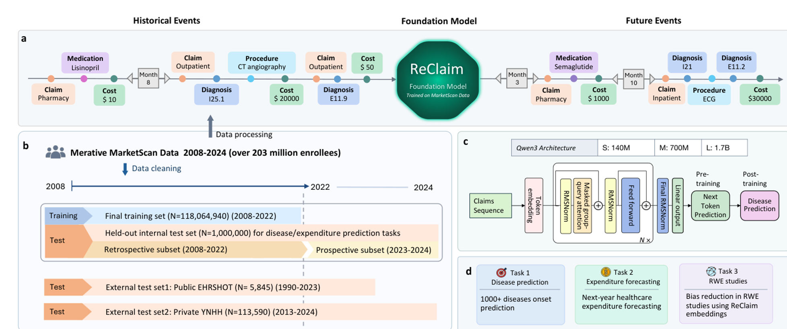

# ReClaim

This repository contains code for ReClaim, a family of generative transformer
models for longitudinal medical claims trajectories.

ReClaim is described in the paper
[Foundation Models to Unlock Real-World Evidence from Nationwide Medical Claims](https://arxiv.org/abs/2605.02740).
The paper studies administrative claims as a substrate for healthcare foundation
models, training ReClaim on nationwide MarketScan claims trajectories and
evaluating it across disease-onset prediction, expenditure forecasting, and
real-world evidence analyses.



## Codebase Overview

The repository is organized as a research pipeline:

| Path | Purpose |
|------|---------|
| `preprocessing/` | Build vocabulary mappings and convert MarketScan, EHRSHOT, and YNHH data into ReClaim-compatible token sequences. |
| `training/` | Build Hugging Face tokenizers, prepare pre-training and post-training datasets, and train Qwen-style causal language models. |
| `downstream_tasks/disease_onset_prediction/` | Prepare disease case/control cohorts, run model inference, and compute disease-onset AUCs. |
| `downstream_tasks/expenditure_forecasting/` | Predict next-year healthcare expenditure from tokenized patient history using ReClaim generations and tabular baselines. |
| `downstream_tasks/rwe_support/` | Generate patient embeddings and evaluate their use in real-world evidence target-trial analyses. |
| `figures/` | Figure assets and editable slide materials. |

## Workflow

At a high level, the project follows this order:

1. Generate medical vocabulary mappings under `preprocessing/vocab_mapping/`.
2. Preprocess raw claims or OMOP-style EHR data into monthly token sequences.
3. Build a tokenizer and train or post-train ReClaim models under `training/`.
4. Run downstream evaluations for disease onset, cost forecasting, and RWE support.

Each major folder has its own README with the expected inputs, local path
configuration, and stage-by-stage commands.

## Notes

Large raw datasets, generated mappings, model checkpoints, logs, and most
intermediate outputs are not included in this repository. Many scripts are
designed for a Slurm/HPC environment and require local paths or environment
variables to be configured before running.

## Citation

If you use this code, please cite the ReClaim paper:

```bibtex
@misc{ma2026reclaim,
  title = {Foundation Models to Unlock Real-World Evidence from Nationwide Medical Claims},
  author = {Ma, Fan and Liu, Yuntian and Lan, Xiang and others},
  year = {2026},
  eprint = {2605.02740},
  archivePrefix = {arXiv},
  primaryClass = {cs.AI}
}
```
